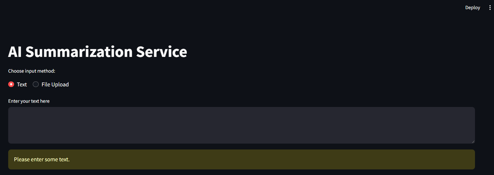

# Summarization Service

## Overview

This project provides advanced summarization functionality using state-of-the-art models for both abstractive and extractive summarization. Users can obtain summaries of provided text or uploaded files and ask questions about their documents.

## Features

### Upload file or provide text 

### Abstractive Summarization
Abstractive summarization generates new sentences that capture the essence of the original text. The models implemented for this are:
- OpenAI
- Gemini
- Llama
- Mixtral
- Gemma
- Pegasus

### Extractive Summarization
Extractive summarization selects and compiles existing sentences from the original text to create a summary. The models implemented for this are:
- LuhnSumy
- BERT

## Usage

1. **Select a Model:**
   - Choose either an abstractive or extractive summarization model.
  

2. **Get Summary:**
   - The system will generate a summary using the selected model.

3. **Question Answering:**
   - If you have additional questions about the document, you can ask them.
   - The QA system, powered by the Llama-3 model, will provide answers.
   - Vectors are stored using Pinecone serverless.

## Technical Details

- **Abstractive Summarization Models:** OpenAI, Gemini, Llama, Mixtral, Gemma, Pegasus
- **Extractive Summarization Models:** LuhnSumy, BERT
- **QA System Model:** Llama-3
- **Vector Storage:** Pinecone serverless

